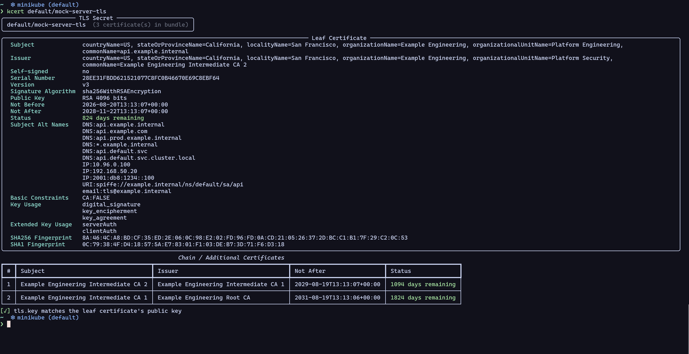

# KCert

Fetch a kubernetes TSL secrets and inspect it's details

## Prerequisites

- Python 3.13+
- `kubectl` installed
- `uv` toolchain

## Installation

You can either use the script directly.

```bash
cd kcert
uv sync
uv run kcert <namespace>/<secret_name>
```

or install it globally:

```bash
cd kcert
uv tool install .
kcert <namespace>/<secret_name>
```

## Usage

Example:

```bash
kcert <namespace>/<secret_name>
```

Use a specific context:

```bash
kcert <namespace>/<secret_name> --context <context_name>
```


